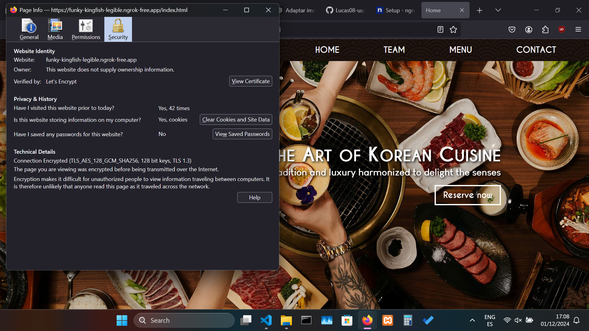

# Web Hosting

## Hosting y dominio de mi sitio web

En esta práctica he usado ngrok, un servicio gratuito que ofrece un dominio y hosting gratuito. Aquí dejo la url de la página oficial de ngrok:

[Visita ngrok](https://ngrok.com/)

### Cambios en el Vagrantfile

He modificado el archivo Vagrantfile que he usado en la práctica anterior y le he añadido estas líneas, que aparecen como tutorial en el sitio oficial de ngrok para que al iniciar la maquina virtual, esta se pueda ver a través del dominio gratuito que ofrece ngrok:

```
sudo apt-get install -y curl

    curl -sSL https://ngrok-agent.s3.amazonaws.com/ngrok.asc \
	| sudo tee /etc/apt/trusted.gpg.d/ngrok.asc >/dev/null \
	&& echo "deb https://ngrok-agent.s3.amazonaws.com buster main" \
	| sudo tee /etc/apt/sources.list.d/ngrok.list \
	&& sudo apt update \
	&& sudo apt install ngrok

    ngrok config add-authtoken 2pX5ecjSZHMi6vnTxGuKNcQu6LU_29DTXuDmKySzCo1GAniQf
    sudo nohup ngrok http --url=funky-kingfish-legible.ngrok-free.app 443 & 
```
También creo estos dos usuarios que voy a usar más adelante:
```
    sudo sh -c "echo 'admin:$(openssl passwd -apr1 asir)' >> /etc/nginx/admin.htpasswd"

    sudo sh -c "echo 'sysadmin:$(openssl passwd -apr1 risa)' >> /etc/nginx/status.htpasswd"
```
No tengo que hacer ningún tipo de redirección de puertos ni configurar el dns, puesto que todo esto ya me lo hace el hosting gratuito de ngrok.

### Certificado de Let's Encrypt

El hosting de ngrok crea un certificado de Let's Encrypt para mi dominio, por lo que no tengo que hacerlo por mi cuenta. De todas maneras, quiero mostrar en esta imagen cómo el certificado que se genera con Let's Encrypt se puede ver en el navegador:



## Página de error personalizada

He creado en html una página de error personalizada que se muestra cuando se intente acceder a la web desde una ruta que no existe. Para ello, he modificado el fichero lucas.com que se encuentra en sites-available y he añadido estas líneas:

```
error_page 404 /404.html;

    # Location for custom error page
    location = /404.html {
        root /var/www/lucas/html;
        internal;
    }
```

Este es el archivo 404.html que se encuentra en html:

```
<!DOCTYPE html>
<html lang="en">
<head>
    <meta charset="UTF-8">
    <meta name="viewport" content="width=device-width, initial-scale=1.0">
    <title>Page Not Found</title>
    <style>
        body {
            font-family: Arial, sans-serif;
            text-align: center;
            margin-top: 10%;
            background-color: #f4f4f4;
            color: #333;
        }
        h1 {
            font-size: 3em;
        }
        p {
            font-size: 1.2em;
        }
        a {
            color: #007BFF;
            text-decoration: none;
        }
        a:hover {
            text-decoration: underline;
        }
    </style>
</head>
<body>
    <h1>404 - Page Not Found</h1>
    <p>Sorry, the page you are looking for does not exist.</p>
    <a href="/">Go Back Home</a>
</body>
</html>
```

Aquí muestro el navegador con la página de error personalizada:


## Descargar una imagen al poner /logo.png

Para que se descargue la imagen logo.png, he añadido estas líneas en el archivo lucas.com, indicando la ruta en donde se encuentra esta imagen en mi html para que se pueda descargar:

```
location /logo.png {
        root /var/www/lucas/html/assets/img/;  # La ruta donde se encuentra mi logo.png
        add_header Content-Disposition 'attachment; filename="logo.png"';
    }
```

Aquí muestro una captura de pantalla del navegador con la imagen descargada al poner /logo.png:


##