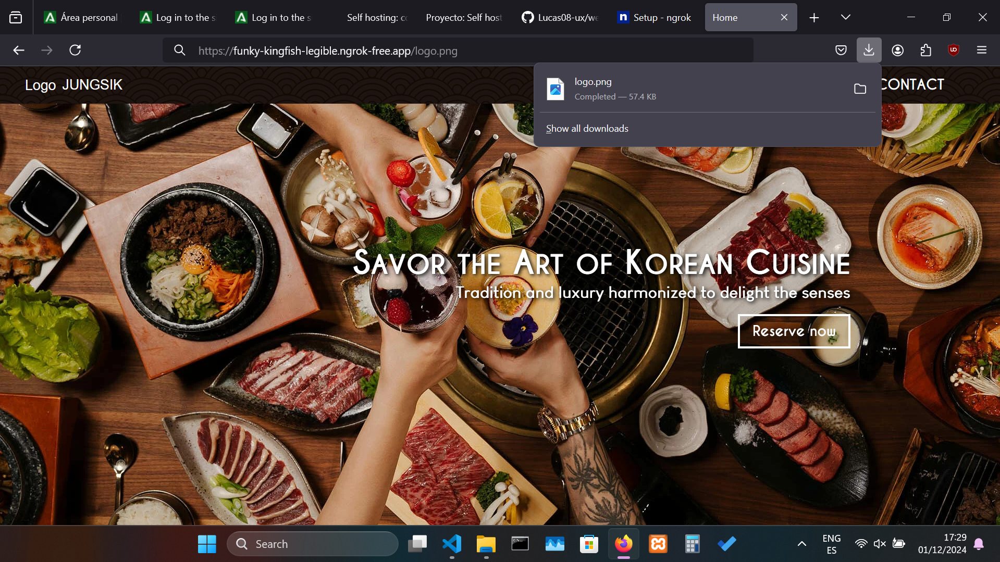
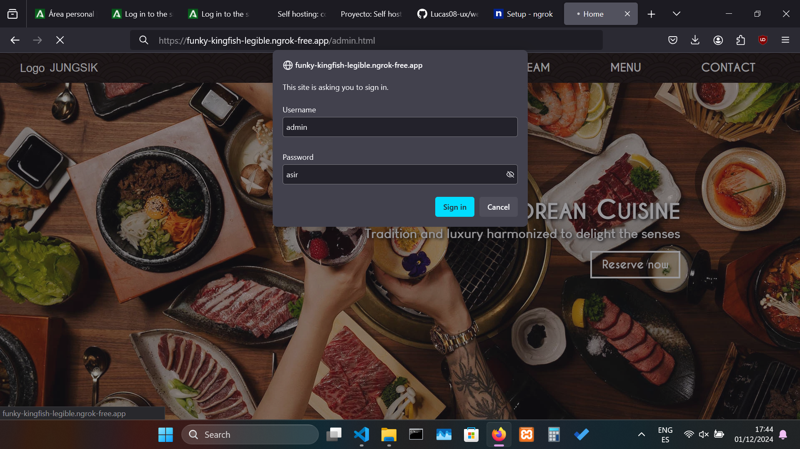
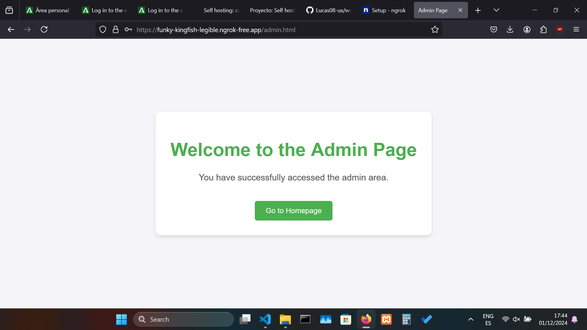
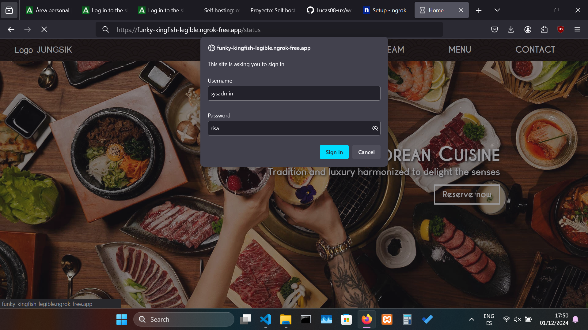
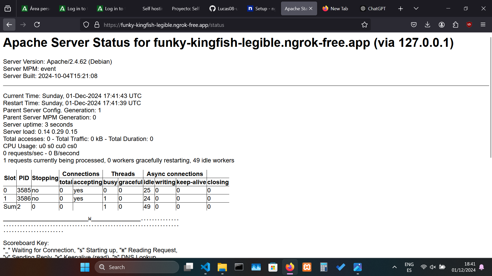
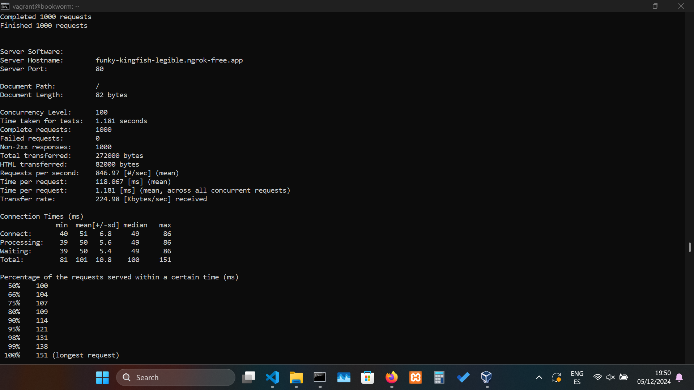
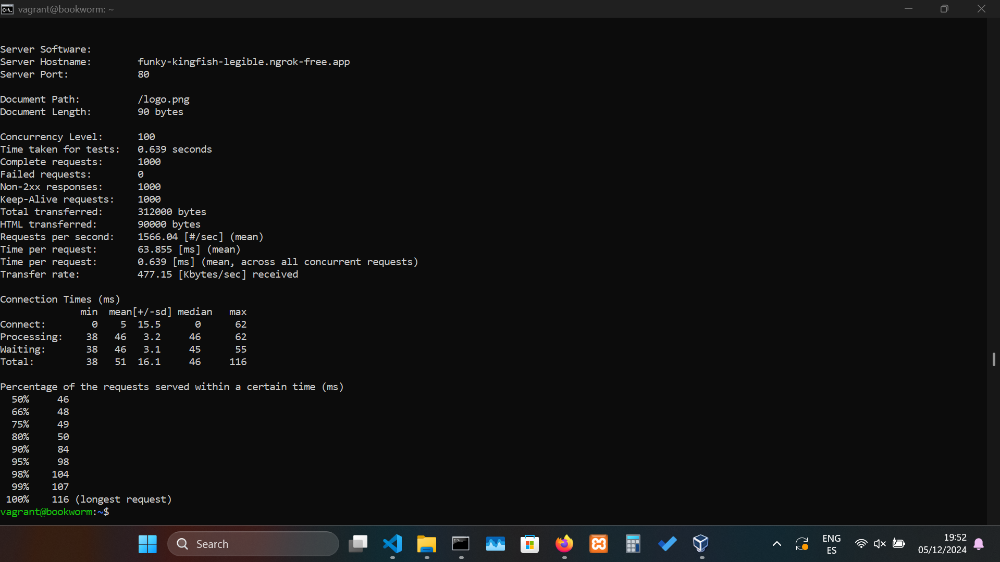
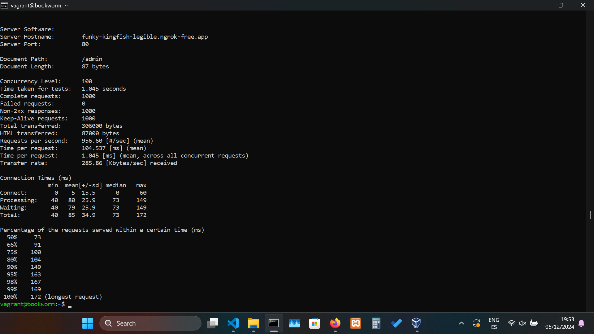

# Web Hosting

## Hosting y dominio de mi sitio web

En esta práctica he usado ngrok, un servicio gratuito que ofrece un dominio y hosting gratuito. Aquí dejo la url de la página oficial de ngrok:

[Visita ngrok](https://ngrok.com/)

### Cambios en el Vagrantfile

He modificado el archivo Vagrantfile que he usado en la práctica anterior y le he añadido estas líneas, que aparecen como tutorial en el sitio oficial de ngrok para que al iniciar la maquina virtual, esta se pueda ver a través del dominio gratuito que ofrece ngrok:

```
sudo apt-get install -y curl

    curl -sSL https://ngrok-agent.s3.amazonaws.com/ngrok.asc \
	| sudo tee /etc/apt/trusted.gpg.d/ngrok.asc >/dev/null \
	&& echo "deb https://ngrok-agent.s3.amazonaws.com buster main" \
	| sudo tee /etc/apt/sources.list.d/ngrok.list \
	&& sudo apt update \
	&& sudo apt install ngrok

    ngrok config add-authtoken 2pX5ecjSZHMi6vnTxGuKNcQu6LU_29DTXuDmKySzCo1GAniQf
    sudo nohup ngrok http --url=funky-kingfish-legible.ngrok-free.app 443 & 
```
También creo estos dos usuarios que voy a usar más adelante. Cada usuario tiene un fichero .htpasswd distinta, porque en la práctica hay un usuario que tiene solo acceso a una zona y no a otras y lo mismo con el otro usuario:
```
    sudo sh -c "echo 'admin:$(openssl passwd -apr1 asir)' >> /etc/nginx/admin.htpasswd"

    sudo sh -c "echo 'sysadmin:$(openssl passwd -apr1 risa)' >> /etc/nginx/status.htpasswd"
```
No tengo que hacer ningún tipo de redirección de puertos ni configurar el dns, puesto que todo esto ya me lo hace el hosting gratuito de ngrok.

### Certificado de Let's Encrypt

El hosting de ngrok crea un certificado de Let's Encrypt para mi dominio, por lo que no tengo que hacerlo por mi cuenta. De todas maneras, quiero mostrar en esta imagen cómo el certificado que se genera con Let's Encrypt se puede ver en el navegador:


## Página de error personalizada

He creado en html una página de error personalizada que se muestra cuando se intente acceder a la web desde una ruta que no existe. Para ello, he modificado el fichero lucas.com que se encuentra en sites-available y he añadido estas líneas:

```
error_page 404 /404.html;

    # Location for custom error page
    location = /404.html {
        root /var/www/lucas/html;
        internal;
    }
```

Este es el archivo 404.html que se encuentra en html:

```
<!DOCTYPE html>
<html lang="en">
<head>
    <meta charset="UTF-8">
    <meta name="viewport" content="width=device-width, initial-scale=1.0">
    <title>Page Not Found</title>
    <style>
        body {
            font-family: Arial, sans-serif;
            text-align: center;
            margin-top: 10%;
            background-color: #f4f4f4;
            color: #333;
        }
        h1 {
            font-size: 3em;
        }
        p {
            font-size: 1.2em;
        }
        a {
            color: #007BFF;
            text-decoration: none;
        }
        a:hover {
            text-decoration: underline;
        }
    </style>
</head>
<body>
    <h1>404 - Page Not Found</h1>
    <p>Sorry, the page you are looking for does not exist.</p>
    <a href="/">Go Back Home</a>
</body>
</html>
```

Aquí muestro el navegador con la página de error personalizada:


## Descargar una imagen al poner /logo.png

Para que se descargue la imagen logo.png, he añadido estas líneas en el archivo lucas.com, indicando la ruta en donde se encuentra esta imagen en mi html para que se pueda descargar:

```
location /logo.png {
        root /var/www/lucas/html/assets/img/;  # La ruta donde se encuentra mi logo.png
        add_header Content-Disposition 'attachment; filename="logo.png"';
    }
```

Aquí muestro una captura de pantalla del navegador con la imagen descargada al poner /logo.png:



## Administración 

He creado una página html personalizada que llama admin.html se mostrará una vez que el usuario admin se haya identificado correctamente:

```
<!DOCTYPE html>
<html lang="en">
<head>
    <meta charset="UTF-8">
    <meta name="viewport" content="width=device-width, initial-scale=1.0">
    <title>Admin Page</title>
    <style>
        body {
            margin: 0;
            padding: 0;
            font-family: Arial, sans-serif;
            background-color: #f4f4f9;
            color: #333;
            display: flex;
            align-items: center;
            justify-content: center;
            height: 100vh;
        }

        .admin-container {
            text-align: center;
            background: #ffffff;
            padding: 2rem;
            border-radius: 10px;
            box-shadow: 0 4px 6px rgba(0, 0, 0, 0.1);
        }

        .admin-container h1 {
            font-size: 2.5rem;
            color: #4CAF50;
        }

        .admin-container p {
            font-size: 1.2rem;
            margin: 1rem 0;
            color: #555;
        }

        .admin-container .cta {
            display: inline-block;
            margin-top: 1.5rem;
            padding: 0.75rem 1.5rem;
            font-size: 1rem;
            color: white;
            background-color: #4CAF50;
            text-decoration: none;
            border-radius: 5px;
            transition: background-color 0.3s;
        }

        .admin-container .cta:hover {
            background-color: #45a049;
        }
    </style>
</head>
<body>
    <div class="admin-container">
        <h1>Welcome to the Admin Page</h1>
        <p>You have successfully accessed the admin area.</p>
        <a href="/" class="cta">Go to Homepage</a>
    </div>
</body>
</html>
```

Aquí muestro las líneas que he añadido en el archivo lucas.com para que se muestre la página admin.html al introducir las credenciales correctas:

```
    location /admin {
        auth_basic "Área restringida";
        auth_basic_user_file /etc/nginx/admin.htpasswd;
    }
```

Aquí muestro una captura cuando pide las credenciales:



Aquí muestro una captura cuando se ha introducido correctamente las credenciales y se muestra la página del admin:



## Status

Para que al escribir /status en la url aparezca el módulo de status, he añadido estas líneas en el archivo lucas.com. Por supuesto, también pide las credenciales correctas. De esta manera redirijo a apache para hacer el mod status:

```
    location /status {
        auth_basic "Área restringida";
        auth_basic_user_file /etc/nginx/status.htpasswd;

        proxy_pass http://127.0.0.1:8080/status;  # Redirige las solicitudes a Apache en el puerto 8080
        proxy_set_header Host $host;            # Establece el encabezado de host
        proxy_set_header X-Real-IP $remote_addr;  # Establece la IP real del cliente
        proxy_set_header X-Forwarded-For $proxy_add_x_forwarded_for;  # Propaga la cabecera de IP
    }
```

Para configurar apache para que haga el mod status, primero lo he instalado, indicando esto en el vagrantfile y luego he modificado dos archivos. El primero es apache2.conf y he indicado con estas líneas que al poner /status en la url, se muestre el mod status:

```
<Location "/status">
    SetHandler server-status
</Location>
```

Para que esto funcione como tanto nginx como apache usan el puerto 80, he modificado el archivo ports.conf para que apache use el puerto 8080 poniendo esta línea:

```
Listen 8080
```

Aquí muestro una captura de pantalla del navegador donde se muestra que al escribir /status, me pide las credenciales:



Aquí muestro una captura de pantalla del navegador donde se muestra correctamente que se ha introducido las credenciales y se muestra el mod status:



## Prueba de Rendimiento

### A - Prueba 1: 100 usuarios concurrentes, 1000 peticiones

#### Prueba para la página principal con SSL/TLS
He usado este comando:

```
ab -n 1000 -c 100 -k https://funky-kingfish-legible.ngrok-free.app/
```

Imagen mostrando el resultado final:


#### Prueba para el recurso (logo)
He usado este comando:

```
ab -n 1000 -c 100 -k https://funky-kingfish-legible.ngrok-free.app/logo.png
```

Imagen mostrando el resultado final:


#### Prueba para admin

He usado este comando:
```
ab -n 1000 -c 100 -k -H "Authorization: Basic YWRtaW46YXNpcg==" https://funky-kingfish-legible.ngrok-free.app/admin
```

Imagen mostrando el resultado final:



### B - Prueba 2: 1000 usuarios concurrentes, 10000 peticiones

#### Prueba para la página principal con SSL/TLS
He usado este comando:

```
ab -n 10000 -c 1000 -k https://funky-kingfish-legible.ngrok-free.app/
```

Imagen mostrando el resultado final:


#### Prueba para el recurso (logo)
He usado este comando:

```
ab -n 10000 -c 1000 -k https://funky-kingfish-legible.ngrok-free.app/logo.png
```

Imagen mostrando el resultado final:


#### Prueba para admin

He usado este comando:
```
ab -n 10000 -c 1000 -k -H "Authorization: Basic YWRtaW46YXNpcg==" https://funky-kingfish-legible.ngrok-free.app/admin
```

Imagen mostrando el resultado final:


# Cómo acceder a la web

Para acceder a la web, simplemente hay que hacer vagrant up y posteriormente acceder a esta url:

[Mi pagina web](https://funky-kingfish-legible.ngrok-free.app/)